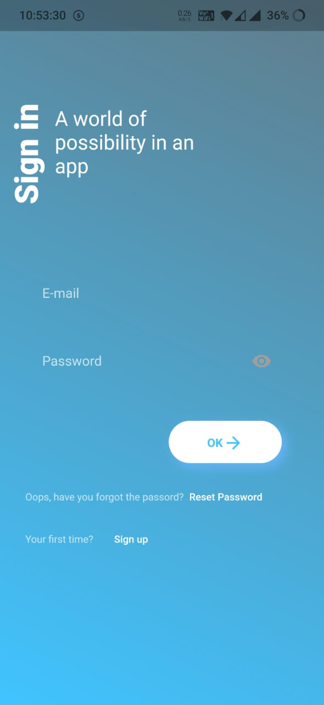

# Disaster-Recovery 
Disaster Recovery would be a good platform for the user who is in struggle during various natural disasters to find whatever is required for them and search and get them during the disaster.

# Screenshots

